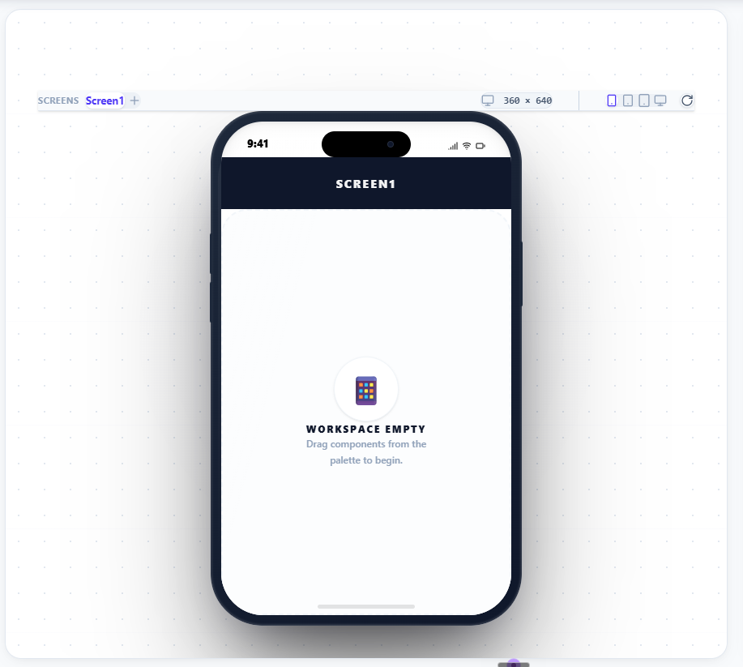

# LeapBlocks - Quick Start Guide

## 🚀 Starting the Application

### Option 1: Electron App (Recommended for ESP32 Simulation)
```powershell
npm run dev
```
This starts the Electron desktop application with full hardware access.

### Option 2: Web Version
```powershell
npm run dev:web
```
This starts:
1. Compiler server on http://localhost:3001
2. Web app on http://localhost:5173

### Option 3: Just the Compiler Server
```powershell
npm run dev:server
```
Starts only the compiler server (already running in your case).

## 📋 Current Status

✅ **Compiler Server:** Running on http://localhost:3001 (Terminal ID: 4)
- Arduino CLI: v1.4.1
- ESP32 Core: Ready
- Status: Operational

⏳ **Main Application:** Not started yet

## 🎯 Next Steps

1. **Start the main app:**
   ```powershell
   npm run dev
   ```

2. **Open ForgeStudio** in the app

3. **Select ESP32-C3** board

4. **Test with this code:**
   ```cpp
   void setup() {
     pinMode(2, OUTPUT);
     Serial.begin(115200);
     Serial.println("ESP32-C3 Ready!");
   }

   void loop() {
     digitalWrite(2, HIGH);
     Serial.println("LED ON");
     delay(1000);
     digitalWrite(2, LOW);
     Serial.println("LED OFF");
     delay(1000);
   }
   ```

5. **Click "Compile & Run"**

6. **Check Serial Monitor** for output

## 🔧 Troubleshooting

### "Port 3001 already in use"
The compiler server is already running. This is normal. Just start the main app with `npm run dev`.

### "Cannot connect to compiler server"
Check if the server is running:
```powershell
curl http://localhost:3001/health
```

If not running, start it:
```powershell
npm run dev:server
```

### Compilation takes too long
First compile downloads ESP32 core (~200MB). This is normal and only happens once.

## 📁 Project Structure

```
leapblocks/
├── compiler-server/          # Arduino compilation server
│   ├── server.js            # Express server (port 3001)
│   └── arduino-cli/         # Arduino CLI binaries
├── src/
│   ├── Electra/             # Main Electron app
│   │   └── Client/Src/
│   │       ├── ForgeStudio.tsx      # Main IDE
│   │       └── services/
│   │           └── CompilerService.ts
│   └── appinverter/         # MIT App Inventor clone
└── package.json             # Main project scripts
```

## 🎮 Available Scripts

| Command | Description |
|---------|-------------|
| `npm run dev` | Start Electron app |
| `npm run dev:web` | Start web version + server |
| `npm run dev:server` | Start compiler server only |
| `npm run build:web` | Build web version |
| `npm run build:electron` | Build Electron app |
| `npm run build:prod` | Production build |

## 🧪 Testing ESP32 Simulation

See `ESP32_SIMULATION_TEST.md` for detailed test cases and examples.

## 📚 Documentation

- `COMPILER_SERVER_SETUP.md` - Server setup guide
- `COMPILER_SERVER_QUICK_START.md` - Quick start guide
- `ESP32_SIMULATION_FIX.md` - Simulation architecture
- `ESP32_SIMULATION_TEST.md` - Test cases
- `ARCHITECTURE_COMPARISON.md` - Architecture overview

---

**Ready to start?** Run `npm run dev` from the main directory!
