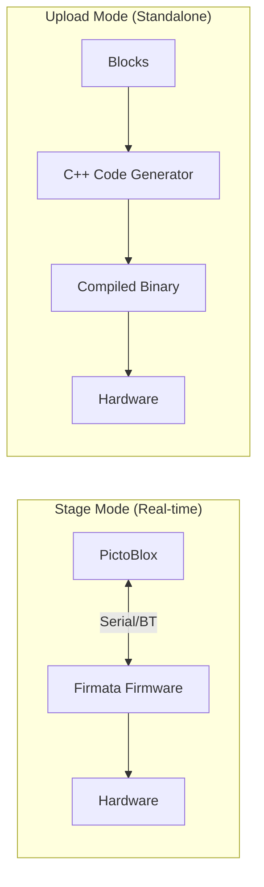

# PictoBlox Research Report

## Executive Summary

PictoBlox is an **educational block-based programming platform** developed by STEMpedia. It is **closed-source** (no public source code), but is built on **Scratch 3.0** which has open-source components. This document details how PictoBlox implements animation and hardware features for block programming.

---

## Architecture Overview

### Foundation: Scratch 3.0

PictoBlox is built on Scratch 3.0's architecture. Key open-source components:

| Component | Purpose | GitHub |
|-----------|---------|--------|
| `scratch-blocks` | Visual block editor (Blockly-based) | [github.com/scratchfoundation/scratch-blocks](https://github.com/scratchfoundation/scratch-blocks) |
| `scratch-vm` | Virtual Machine - executes block programs | [github.com/scratchfoundation/scratch-vm](https://github.com/scratchfoundation/scratch-vm) |
| `scratch-gui` | React-based GUI interface | [github.com/scratchfoundation/scratch-gui](https://github.com/scratchfoundation/scratch-gui) |
| `scratch-paint` | Sprite/costume editor | [github.com/scratchfoundation/scratch-paint](https://github.com/scratchfoundation/scratch-paint) |
| `scratch-storage` | Asset storage/loading | [github.com/scratchfoundation/scratch-storage](https://github.com/scratchfoundation/scratch-storage) |

---

## Animation System

### Core Concepts

```
┌─────────────────────────────────────────────────────────────┐
│                         STAGE                                │
│  ┌─────────────────────────────────────────────────────────┐│
│  │                    Backdrop                              ││
│  │                                                          ││
│  │     ┌─────────┐     ┌─────────┐     ┌─────────┐         ││
│  │     │ Sprite1 │     │ Sprite2 │     │ Sprite3 │         ││
│  │     │(Costume │     │(Costume │     │(Costume │         ││
│  │     │   A)    │     │   B)    │     │   C)    │         ││
│  │     └─────────┘     └─────────┘     └─────────┘         ││
│  │                                                          ││
│  └─────────────────────────────────────────────────────────┘│
│               Stage: 480x360 pixels                          │
│               Center: (0, 0)                                 │
│               X range: -240 to 240                           │
│               Y range: -180 to 180                           │
└─────────────────────────────────────────────────────────────┘
```

### Animation Block Categories

#### 1. Motion Blocks (Blue - `#4C97FF`)

| Block | Description | Parameters |
|-------|-------------|------------|
| `move () steps` | Move sprite forward | steps (1 step = 1 pixel) |
| `turn ↻ () degrees` | Rotate clockwise | degrees |
| `turn ↺ () degrees` | Rotate counter-clockwise | degrees |
| `go to x: () y: ()` | Instant teleport | x, y coordinates |
| `go to (random/mouse/sprite)` | Go to position | target |
| `glide () secs to x: () y: ()` | Smooth movement over time | seconds, x, y |
| `glide () secs to ()` | Glide to target | seconds, target |
| `point in direction ()` | Set absolute rotation | degrees (0=up, 90=right) |
| `point towards ()` | Face target | mouse/sprite |
| `change x by ()` | Move horizontally | delta x |
| `change y by ()` | Move vertically | delta y |
| `set x to ()` | Set horizontal position | x coordinate |
| `set y to ()` | Set vertical position | y coordinate |
| `if on edge, bounce` | Reverse direction at edge | - |
| `set rotation style ()` | Control sprite rotation | left-right/don't rotate/all around |
| `x position` (reporter) | Get current X | - |
| `y position` (reporter) | Get current Y | - |
| `direction` (reporter) | Get current direction | - |

#### 2. Looks Blocks (Purple - `#9966FF`)

| Block | Description | Parameters |
|-------|-------------|------------|
| `say () for () seconds` | Show speech bubble | text, seconds |
| `say ()` | Show persistent speech bubble | text |
| `think () for () seconds` | Show thought bubble | text, seconds |
| `think ()` | Show persistent thought bubble | text |
| `switch costume to ()` | Change specific costume | costume name |
| `next costume` | Cycle to next costume | - |
| `switch backdrop to ()` | Change stage backdrop | backdrop name |
| `next backdrop` | Cycle to next backdrop | - |
| `change size by ()` | Relative size change | percent |
| `set size to () %` | Absolute size | percent |
| `change () effect by ()` | Modify graphic effect | effect, value |
| `set () effect to ()` | Set graphic effect | effect, value |
| `clear graphic effects` | Reset all effects | - |
| `show` | Make sprite visible | - |
| `hide` | Make sprite invisible | - |
| `go to () layer` | Set layer (front/back) | position |
| `go () () layers` | Move layers (forward/backward) | direction, count |
| `costume #` (reporter) | Get current costume number | - |
| `costume name` (reporter) | Get current costume name | - |
| `backdrop #` (reporter) | Get current backdrop number | - |
| `backdrop name` (reporter) | Get current backdrop name | - |
| `size` (reporter) | Get current size | - |

**Graphic Effects:**
- color, fisheye, whirl, pixelate, mosaic, brightness, ghost

#### 3. Events Blocks (Yellow/Gold - `#FFBF00`)

| Block | Description |
|-------|-------------|
| `when green flag clicked` | Program start |
| `when () key pressed` | Key press event |
| `when this sprite clicked` | Click on sprite |
| `when backdrop switches to ()` | Backdrop change event |
| `when () > ()` (loudness/timer) | Sensor threshold |
| `broadcast ()` | Send message |
| `broadcast () and wait` | Send message and wait |
| `when I receive ()` | Receive message |

#### 4. Control Blocks (Orange - `#FFAB19`)

| Block | Description |
|-------|-------------|
| `wait () seconds` | Pause execution |
| `repeat ()` | Loop N times |
| `forever` | Infinite loop |
| `if () then` | Conditional |
| `if () then / else` | Conditional with else |
| `wait until ()` | Wait for condition |
| `repeat until ()` | Loop until condition |
| `stop ()` | Stop scripts |
| `when I start as a clone` | Clone event |
| `create clone of ()` | Create clone |
| `delete this clone` | Remove clone |

---

## Hardware Integration

### Two Operating Modes



### Stage Mode

**Purpose:** Real-time interactive control while connected to computer.

**How it works:**
1. One-time firmware upload to board (similar to Firmata)
2. Board stays connected via USB/Bluetooth
3. Blocks execute on computer, send commands to board in real-time
4. Sensor data streams back to computer
5. Enables sprite-hardware interaction (e.g., sensors controlling animation)

**Supported Boards:** Arduino Uno, Mega, Nano, ESP32, micro:bit, LEGO EV3/Boost/WeDo

**Use Case:** Interactive games, animations responding to sensors, learning/experimentation

### Upload Mode

**Purpose:** Standalone operation - code runs on the board without computer.

**How it works:**
1. Blocks are converted to C++ code
2. Code is compiled and uploaded to board
3. Board runs independently after upload
4. No real-time communication needed
5. Stage/Sprite palettes are hidden (not applicable)

**Use Case:** Robots, standalone devices, field deployments

### Hardware Block Categories

#### Arduino Extension Blocks

| Category | Blocks |
|----------|--------|
| **Digital I/O** | `set digital pin () output as ()`, `read status of digital pin ()` |
| **Analog I/O** | `read analog pin ()` (0-1023), `set PWM pin () output as ()` (0-255) |
| **Servo** | `set servo on () to () angle` (0-180°) |
| **Ultrasonic** | `read ultrasonic sensor distance (cm)` |
| **DHT** | `read temperature/humidity from DHT on pin ()` |
| **Serial** | `serial begin ()`, `serial print ()`, `serial read/available` |
| **Timing** | `wait () ms`, `millis()` |

#### Pin Configurations

| Board | Digital Pins | Analog Pins | PWM Pins |
|-------|--------------|-------------|----------|
| Arduino Uno | 2-13 | A0-A5 | 3, 5, 6, 9, 10, 11 |
| Arduino Mega | 2-53 | A0-A15 | 2-13, 44-46 |
| Arduino Nano | 2-13 | A0-A7 | 3, 5, 6, 9, 10, 11 |
| ESP32 | 0-39 | A0-A19 | 0-39 (all GPIO) |

---

## Comparison: PictoBlox vs Current LeetBlocks

### What LeetBlocks Already Has ✅

| Feature | Status |
|---------|--------|
| Block-based editor (Blockly) | ✅ Complete |
| Arduino block definitions | ✅ Complete |
| C++ code generation | ✅ Complete |
| Digital I/O blocks | ✅ Complete |
| Analog I/O blocks | ✅ Complete |
| PWM blocks | ✅ Complete |
| Serial communication blocks | ✅ Complete |
| Sensor blocks (ultrasonic, DHT, LDR, PIR, etc.) | ✅ Complete |
| Actuator blocks (servo, motor, LED, relay) | ✅ Complete |
| Control blocks (if, repeat, wait, forever) | ✅ Complete |
| Operator blocks (math, comparison, logic) | ✅ Complete |
| PictoBlox-style toolbox styling | ✅ Complete |
| Code preview panel | ✅ Complete |

### What's Missing for Animation ❌

| Feature | Description | Priority |
|---------|-------------|----------|
| **Stage/Canvas** | 480x360 rendering area | High |
| **Sprite System** | Sprite entities with x, y, direction, size | High |
| **Costume Management** | Multiple images per sprite | High |
| **Motion Blocks** | move, glide, turn, point | High |
| **Looks Blocks** | say, switch costume, show/hide | High |
| **Animation Loop** | 30/60 FPS rendering loop | High |
| **Sprite Editor** | Create/edit costumes | Medium |
| **Sound System** | Play sounds from sprites | Medium |

### What's Missing for Complete Hardware ❌

| Feature | Description | Priority |
|---------|-------------|----------|
| **Stage Mode** | Real-time serial communication | High |
| **Firmware Upload** | One-time firmata-like firmware | High |
| **Board Detection** | Auto-detect connected boards | Medium |
| **Serial Monitor** | Live data visualization | Medium |
| **Upload Mode** | Already implemented (current mode) | ✅ Done |

---

## Implementation Recommendations

### For Animation (Stage Mode)

1. **Create Stage Component**
   - HTML5 Canvas (480x360)
   - Rendering loop at 30/60 FPS
   - Coordinate system with (0,0) at center

2. **Create Sprite Class**
   ```typescript
   interface Sprite {
     id: string;
     name: string;
     x: number;          // position
     y: number;
     direction: number;  // 0-360 degrees
     size: number;       // percentage
     visible: boolean;
     costumes: Costume[];
     currentCostume: number;
     effects: GraphicEffects;
   }
   ```

3. **Implement Motion/Looks Generators**
   - Different from Arduino generator
   - Generates JavaScript for VM execution
   - Real-time interpretation, not compilation

4. **Create Animation VM**
   - Event-driven execution
   - Parallel script execution
   - Hat blocks (events) trigger script runs

### For Hardware (Real-time Stage Mode)

1. **Implement Serial Communication Layer**
   - Web Serial API or Electron serialport
   - Already have `serialport` in project

2. **Create Firmata-like Protocol**
   - Simple command/response protocol
   - Pin modes, read/write operations
   - Sensor data streaming

3. **Bridge Stage and Hardware**
   - Sprites can read sensor values
   - Hardware can respond to sprite events
   - Real-time bidirectional communication

---

## Key Takeaways

1. **PictoBlox is closed-source** - Cannot access their code directly
2. **Built on Scratch 3.0** - Study Scratch's open-source repos for architecture patterns
3. **Two distinct modes** - Stage (real-time) and Upload (standalone)
4. **Animation = Sprites + Costumes + Motion/Looks blocks**
5. **Hardware = Serial communication + Block-to-action mapping**
6. **LeetBlocks already has excellent Upload Mode** - Focus on adding Stage Mode features

---

## References

- [Scratch Foundation GitHub](https://github.com/scratchfoundation)
- [PictoBlox Official Docs](https://thestempedia.com/docs/pictoblox/)
- [Scratch 3.0 Wiki](https://en.scratch-wiki.info/wiki/Scratch_3.0)
