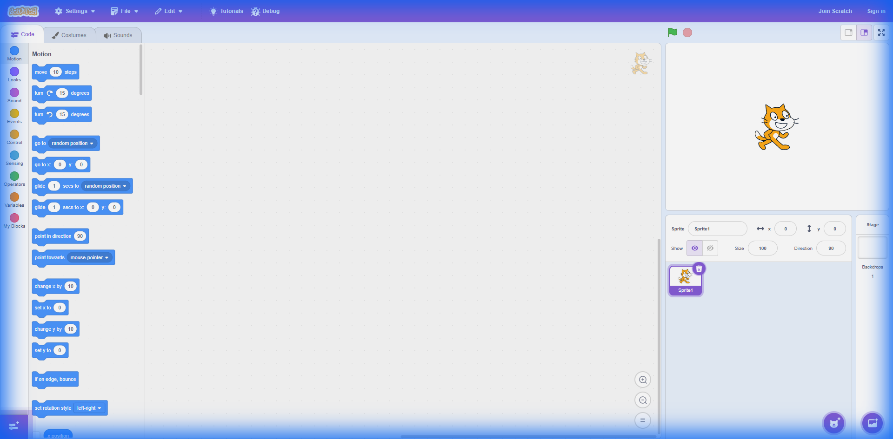
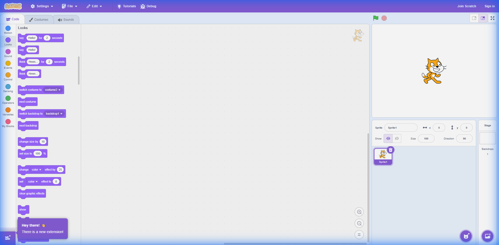
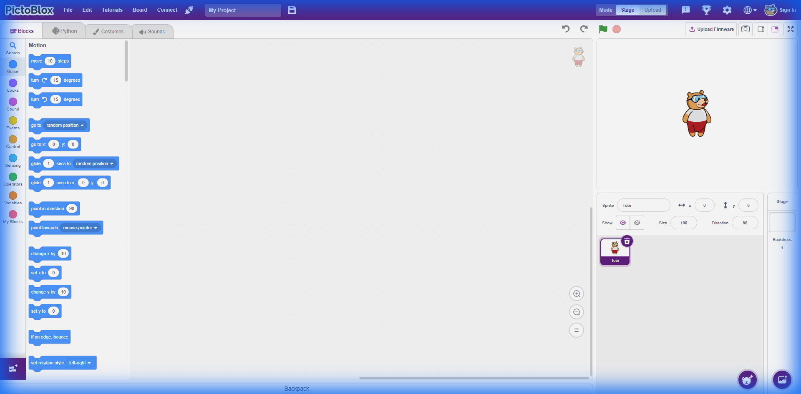
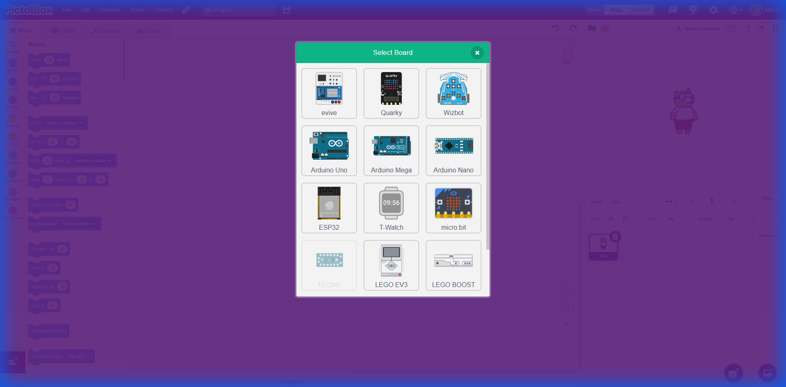
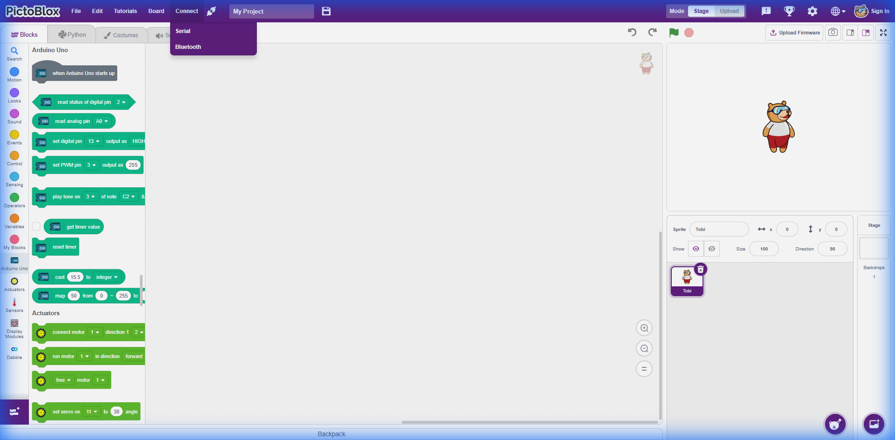
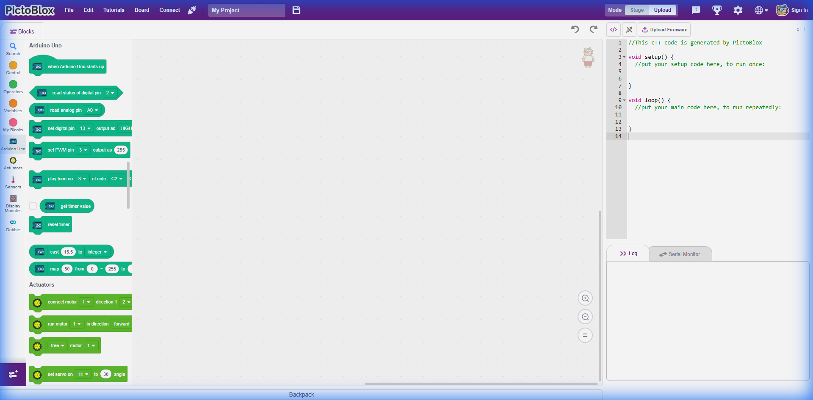
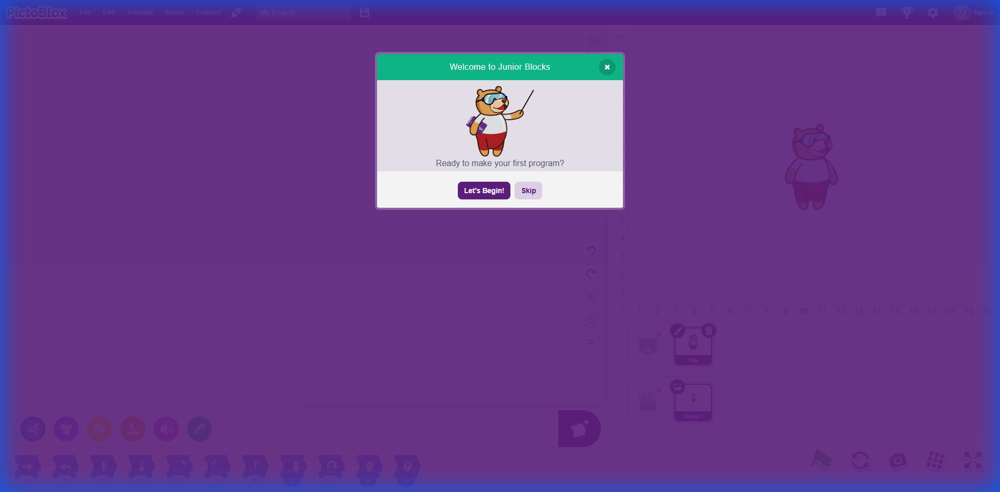

# Scratch & PictoBlox UI Research Report

> Comprehensive analysis of visual programming interfaces for LeapBlocks design

---

## Executive Summary

This document provides extensive research on Scratch 3.0, PictoBlox, and ScratchJr UI design patterns. These platforms represent the gold standard for block-based visual programming interfaces for children and beginners.

---

## 1. Scratch 3.0 Interface Analysis

### 1.1 Overall Layout Structure



The Scratch 3.0 interface follows a **three-panel layout** optimized for visual programming:

| Panel | Location | Purpose |
|-------|----------|---------|
| **Block Palette** | Left | Color-coded categories + draggable blocks |
| **Scripting Area** | Center | Workspace for assembling block scripts |
| **Stage** | Top Right | Visual output (480×360, 4:3 ratio) |
| **Sprite/Backdrop Panes** | Bottom Right | Asset management & properties |

### 1.2 Block Category Color Scheme



Each category uses a distinct, carefully chosen color for instant recognition:

| Category | Color | Hex | Purpose |
|----------|-------|-----|---------|
| **Motion** | Blue | `#4C97FF` | Movement, position, rotation |
| **Looks** | Purple | `#9966FF` | Visual appearance, speech bubbles |
| **Sound** | Pink | `#CF63CF` | Audio playback, effects |
| **Events** | Yellow | `#FFBF00` | Trigger/start blocks (hat blocks) |
| **Control** | Orange | `#FFAB19` | Loops, conditionals, wait |
| **Sensing** | Cyan | `#5CB1D6` | Input detection, mouse, keyboard |
| **Operators** | Green | `#59C059` | Math, comparisons, logic |
| **Variables** | Dark Orange | `#FF8C1A` | Data storage |
| **My Blocks** | Red | `#FF6680` | Custom procedures |

### 1.3 Block Shapes & Semantics

Different block shapes communicate their connection behavior:

```
┌──────────────────────────────────────────────────────┐
│ HAT BLOCKS (Rounded Top)                             │
│ ╭─────────────────╮                                  │
│ │ when 🏁 clicked │  → Starts a script (no input)   │
│ ╰─────────────────╯                                  │
├──────────────────────────────────────────────────────┤
│ STACK BLOCKS (Notched)                               │
│ ┌─────────────────┐                                  │
│ │ move 10 steps   │  → Connects above and below     │
│ └─────────────────┘                                  │
├──────────────────────────────────────────────────────┤
│ C-BLOCKS (C-shaped)                                  │
│ ┌─────────────────┐                                  │
│ │ repeat 10       │  → Contains other blocks        │
│ │ ┌─────────────┐ │                                 │
│ │ │             │ │                                 │
│ │ └─────────────┘ │                                 │
│ └─────────────────┘                                  │
├──────────────────────────────────────────────────────┤
│ REPORTER BLOCKS (Rounded)                            │
│ (  x position  )     → Returns a value              │
├──────────────────────────────────────────────────────┤
│ BOOLEAN BLOCKS (Hexagonal)                           │
│ <  touching ?  >     → Returns true/false           │
├──────────────────────────────────────────────────────┤
│ CAP BLOCKS (Flat Bottom)                             │
│ ┌─────────────────┐                                  │
│ │ stop all        │  → Ends script (no connection)  │
│ ▀▀▀▀▀▀▀▀▀▀▀▀▀▀▀▀▀▀▀                                  │
└──────────────────────────────────────────────────────┘
```

### 1.4 Stage Dimensions

- **Canvas Size**: 480 × 360 pixels (fixed)
- **Aspect Ratio**: 4:3
- **Coordinate System**: 
  - Center: (0, 0)
  - X Range: -240 to +240
  - Y Range: -180 to +180

### 1.5 Tab System

Above the block palette, tabs switch between:
1. **Code** - Block programming
2. **Costumes** - Image/vector editor
3. **Sounds** - Audio editor

---

## 2. PictoBlox Interface Analysis

### 2.1 Standard Editor Layout



PictoBlox builds on Scratch 3.0's foundation with key enhancements:

| Feature | Description |
|---------|-------------|
| **Menu Bar** | Deep purple (#5A2D82), includes Board menu |
| **Mode Toggle** | Switch between Stage Mode and Upload Mode |
| **Board Menu** | Hardware selection (Arduino, ESP32, micro:bit, etc.) |
| **Python Tab** | Full text-based Python IDE alongside blocks |
| **Default Sprite** | "Tobi" the bear mascot |

### 2.2 Hardware Integration (Board Selection)



PictoBlox's **"Select Board"** modal provides extensive hardware support:

| Category | Supported Boards |
|----------|-----------------|
| **STEMpedia Products** | evive, Quarky, Wizbot |
| **Arduino Family** | Arduino Uno, Arduino Mega, Arduino Nano |
| **ESP Family** | ESP32 |
| **Wearables** | T-Watch |
| **Educational** | micro:bit |
| **LEGO Robotics** | LEGO EV3, LEGO BOOST, LEGO WeDo 2.0 |

### 2.3 Stage Mode vs Upload Mode

PictoBlox features a prominent **Mode Toggle** at the top right:

#### Stage Mode (Real-Time Interaction)



| Feature | Description |
|---------|-------------|
| **Purpose** | Real-time interaction between hardware and sprites |
| **UI** | Standard Scratch-like interface with stage visible |
| **Mechanism** | Sends commands in real-time via serial/Bluetooth |
| **Firmware** | One-time "Upload Firmware" (Firmata-style) to board |
| **Use Case** | Interactive games, sensor-responsive animations |

**Key UI Elements in Stage Mode:**
- Connect menu showing Serial/Bluetooth options
- "Upload Firmware" button above stage
- Hardware-specific blocks in green color (#00B050)
- Block categories: Arduino Uno, Actuators, Communication

#### Upload Mode (Standalone Execution)



| Feature | Description |
|---------|-------------|
| **Purpose** | Code runs independently on hardware (no PC needed) |
| **UI** | Stage replaced by C++ code editor panel |
| **Mechanism** | Blocks generate C++ → Compile → Flash to board |
| **Output** | Arduino-compatible setup()/loop() code structure |
| **Use Case** | Robots, IoT devices, standalone projects |

**Key UI Elements in Upload Mode:**
- C++ code panel showing generated code in real-time
- `setup()` and `loop()` functions generated automatically
- Serial Monitor tab for debugging
- Log tab for compilation output
- Blue "Upload" button to flash compiled code

### 2.4 Connection Options

The **Connect** menu provides multiple connectivity methods:

```
┌─────────────────────┐
│     Connect         │
├─────────────────────┤
│ ● Serial            │  → USB cable connection
│ ● Bluetooth         │  → Wireless (Quarky, ESP32, etc.)
│ ● WiFi (ESP32)      │  → Via IoT extensions
└─────────────────────┘
```

### 2.5 Hardware-Specific Blocks

When a board is selected, new block categories appear:

| Category | Color | Blocks |
|----------|-------|--------|
| **Arduino Uno** | Green `#00B050` | Digital/analog pins, PWM |
| **Actuators** | Green | Servo, motor, LED, relay |
| **Sensors** | Green | Ultrasonic, DHT, LDR, PIR |
| **Communication** | Green | Serial print/read, I2C, SPI |
| **Dabble** | Blue | Smartphone app integration |

Example blocks visible in Stage Mode:
- `when Arduino Uno starts up`
- `set status of digital pin () output as ()`
- `read analog pin ()`
- `set PWM pin () output as ()`
- `servo on () to () angle`
- `ultrasonic sensor distance`

### 2.6 PictoBlox Junior (Ages 4-7)



The Junior version features a completely redesigned interface:

| Element | Junior Design |
|---------|---------------|
| **Navigation** | Large icon-only category buttons |
| **Block Palette** | Horizontal strip at bottom |
| **Blocks** | Horizontal puzzle pieces (left-to-right flow) |
| **Stage** | Prominent right-side placement |
| **Text** | Minimal - icons/pictures instead |
| **Colors** | Same category colors but larger, more vibrant |

Key Junior Block Categories:
- **Motion** (blue footprints icon)
- **Looks** (purple eye icon)  
- **Sound** (pink speaker icon)
- **Control** (orange hand icon)
- **Events** (yellow flag icon)
- **Pen** (teal pen icon)

---

## 3. ScratchJr Design Patterns (Ages 5-7)

ScratchJr takes simplification even further for pre-readers:

### 3.1 Key Design Differences from Scratch

| Aspect | Scratch 3.0 | ScratchJr |
|--------|-------------|-----------|
| Block Direction | Vertical stacking | **Horizontal strips** |
| Text | Word labels | **Icons only** |
| Stage Size | 480×360 | Tablet-optimized |
| Coordinate System | Full XY grid | Simplified grid |
| Characters | Multiple sprites | "Characters" |

### 3.2 Block Categories (Icon-Based)

```
Movement  =  🟦 Blue arrow icons
Looks     =  🟣 Purple eye/speech icons
Sound     =  🟢 Green speaker icon
Control   =  🟠 Orange clock/loop icons  
Trigger   =  🟡 Yellow flag/tap icons
End       =  🔴 Red stop icon
```

---

## 4. UI/UX Best Practices for Block-Based Coding

### 4.1 Design Principles

1. **Low Floor, Wide Walls**
   - Easy to start (few concepts needed)
   - Supports complex projects (many possibilities)

2. **Immediate Feedback**
   - See results instantly when running code
   - Blocks provide visual preview on click

3. **Error Prevention**
   - Blocks only connect in valid configurations
   - No syntax errors possible

4. **Progressive Disclosure**
   - Start with simple blocks
   - Advanced features available but not overwhelming

### 4.2 Age-Appropriate Design

| Age | Interface Characteristics |
|-----|---------------------------|
| 4-6 | Horizontal blocks, icon-only, large touch targets, minimal text |
| 7-9 | Vertical blocks, simple labels, basic categories |
| 10+ | Full categories, text labels, extensions, variables |

### 4.3 Visual Design Guidelines

- **Large Touch Targets**: Minimum 44×44px for interactive elements
- **High Contrast Colors**: Each category visually distinct
- **Consistent Iconography**: Icons match block meanings
- **Playful Aesthetics**: Rounded corners, friendly characters
- **Immediate Audio/Visual Feedback**: Sounds and animations on interaction

---

## 5. Recommendations for LeapBlocks UI

### 5.1 Immediate Improvements

1. **Adopt PictoBlox Junior's horizontal block strip layout** for the bottom palette
2. **Increase icon sizes** in category bar (44×44px minimum)
3. **Add Scratch-style stage controls** (green flag, red stop, fullscreen toggle)
4. **Implement sprite property panel** showing x, y, direction, size

### 5.2 Visual Design Updates

```css
/* Recommended color variables matching Scratch/PictoBlox */
:root {
  --motion-color: #4C97FF;
  --looks-color: #9966FF;
  --sound-color: #CF63CF;
  --events-color: #FFBF00;
  --control-color: #FFAB19;
  --sensing-color: #5CB1D6;
  --operators-color: #59C059;
  --variables-color: #FF8C1A;
  --pen-color: #00bfa5;
  
  /* UI accent colors */
  --menu-bar: #5A2D82;
  --stage-bg: #FFFFFF;
  --workspace-bg: #F5F5F5;
}
```

### 5.3 Block Shape Enhancements

- Hat blocks: Rounded top, no input connection
- Stack blocks: Notched top and bottom
- C-blocks: Contain statement inputs
- Cap blocks: Stop script, flat bottom
- Reporter blocks: Rounded pill shape

---

## 6. Browser Recordings

The following recordings show live exploration of the interfaces:

- [Scratch UI Exploration](./scratch_ui_exploration_1769054142335.webp)
- [PictoBlox UI Exploration](./pictoblox_ui_exploration_1769054256696.webp)
- [PictoBlox Hardware Modes](./pictoblox_hardware_modes_1769054796050.webp)

---

## 7. Additional Screenshots

| Screenshot | Description |
|------------|-------------|
| `pictoblox_board_selection_*.png` | Board selection modal |
| `pictoblox_extensions_library_*.png` | AI/ML/IoT extensions |
| `pictoblox_python_interface_*.png` | Python IDE mode |

---

## References

- [Scratch 3.0 Wiki](https://en.scratch-wiki.info/wiki/Scratch_3.0)
- [ScratchJr Official](https://www.scratchjr.org/)
- [PictoBlox Documentation](https://thestempedia.com/docs/pictoblox/)
- [Scratch Foundation GitHub](https://github.com/scratchfoundation)
- [MIT Lifelong Kindergarten Design Principles](https://web.media.mit.edu/~mres/)
